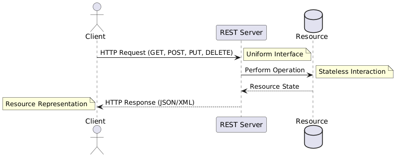
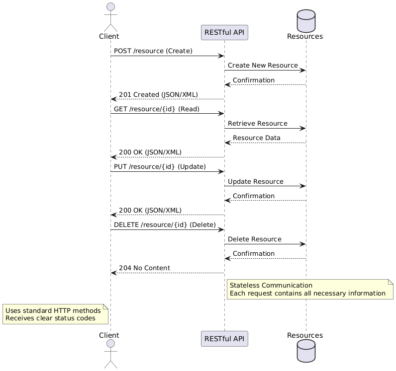
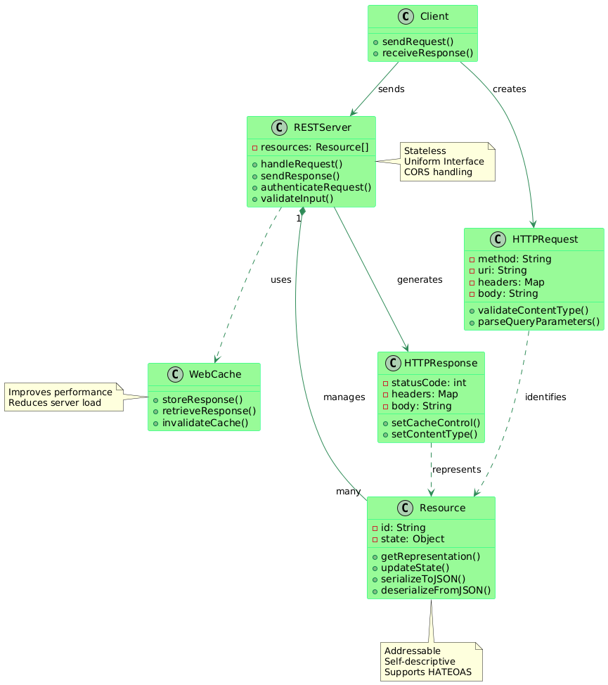

# RESTfulAPI Explained

Welcome to the **RESTfulAPI Explained** repository! This project is a comprehensive guide to learning about **REST APIs** and their integration. 
The repository includes a paper and visual aids to deepen your understanding of RESTful principles and how to implement them. 
The project demonstrates both basic and advanced RESTful API implementations using **Express.js**.

---

## **Table of Contents**
1. [Overview](#overview)
2. [Setup Instructions](#setup-instructions)
3. [API Endpoints](#api-endpoints)
4. [Response Codes](#response-codes)
5. [Running the Server](#running-the-server)
6. [Error Handling](#error-handling)
7. [Rate Limiting](#rate-limiting)
8. [Implementation Details](#implementation-details)
9. [Images](#images)
10. [Getting Started](#getting-started)

---

## **Overview**

This repository provides a practical introduction to RESTful API concepts. It includes:
- A **basic implementation** with essential CRUD operations.
- An **advanced implementation** featuring additional functionality such as CORS, rate limiting, and robust error handling.
- Visual aids and a detailed paper for learning purposes.

## **Setup Instructions**

### Initialize the Project:
```bash
npm init -y
```

### Install Dependencies:
```bash
npm install express body-parser cors
```

---

## **API Endpoints**

### **Items Resource**
| **Method** | **Endpoint**    | **Description**        | **Request Body**            | **Response**               |
|------------|-----------------|------------------------|-----------------------------|----------------------------|
| `GET`      | `/items`        | Retrieve all items     | N/A                         | Array of items             |
| `GET`      | `/items/:id`    | Retrieve a specific item | N/A                       | Single item object         |
| `POST`     | `/items`        | Create a new item      | `{ "name": "string" }`      | Created item               |
| `PUT`      | `/items/:id`    | Update an item         | `{ "name": "string" }`      | Updated item               |
| `DELETE`   | `/items/:id`    | Delete an item         | N/A                         | No content                 |

---

## **Response Codes**

| **Status Code** | **Description**                        |
|------------------|----------------------------------------|
| `200`           | Success - Request completed successfully |
| `201`           | Created - Resource created successfully |
| `204`           | No Content - Request successful, no content returned |
| `400`           | Bad Request - Invalid request format   |
| `404`           | Not Found - Resource not found         |
| `500`           | Server Error - Internal server error   |

---

## **Running the Server**

### Create the server file:
```bash
touch server.js
```

### Start the server:
```bash
node server.js
```

The API will be available at: `http://localhost:3000`

---

## **Accessing the API Endpoints**

Once the server is running, you can access the following endpoints:

1. **Retrieve All Items**  
   - Endpoint: `GET /items`  
   - Example:  
     ```bash
     curl http://localhost:3000/items
     ```
   - Response:  
     ```json
     [
       { "id": 1, "name": "Item 1" },
       { "id": 2, "name": "Item 2" }
     ]
     ```

2. **Retrieve a Specific Item**  
   - Endpoint: `GET /items/:id`  
   - Example:  
     ```bash
     curl http://localhost:3000/items/1
     ```
   - Response:  
     ```json
     { "id": 1, "name": "Item 1" }
     ```

3. **Create a New Item**  
   - Endpoint: `POST /items`  
   - Example:  
     ```bash
     curl -X POST -H "Content-Type: application/json" -d '{"name": "New Item"}' http://localhost:3000/items
     ```
   - Response:  
     ```json
     { "id": 3, "name": "New Item" }
     ```

4. **Update an Item**  
   - Endpoint: `PUT /items/:id`  
   - Example:  
     ```bash
     curl -X PUT -H "Content-Type: application/json" -d '{"name": "Updated Item"}' http://localhost:3000/items/1
     ```
   - Response:  
     ```json
     { "id": 1, "name": "Updated Item" }
     ```

5. **Delete an Item**  
   - Endpoint: `DELETE /items/:id`  
   - Example:  
     ```bash
     curl -X DELETE http://localhost:3000/items/1
     ```
   - Response:  
     ```json
     { "message": "Item deleted successfully" }
     ```

---

## **Testing the API**

To test the API, you can use the following tools:
- **cURL**: Run the provided commands in your terminal.
- **Postman**: A GUI-based tool for testing REST APIs.
- **Browser**: Use the browser to test `GET` endpoints.

---

## **Advanced Features**

The advanced version of the API (`RESTfulAPI2.js`) includes additional functionality such as:
- **Filtering**: Filter items by specific fields. Example: `/items?name=Item1`
- **Sorting**: Sort results. Example: `/items?sort=asc`
- **Pagination**: Retrieve data in chunks. Example: `/items?page=1&limit=10`
- **Health Check Endpoint**: Monitor the API's status at `/health`. Example:
  ```bash
  curl http://localhost:3000/health
  ```
  Response:
  ```json
  { "status": "OK", "uptime": "12345 seconds" }
  ```

These features make the API more practical for real-world scenarios, helping you manage large datasets, check server health, and implement customized queries.

---

## **Logging and Monitoring**

For advanced monitoring and troubleshooting, the API uses **Morgan** for HTTP request logging. This feature generates logs for every incoming request, including details such as the request method, endpoint, and status code.

Example log output:
```
GET /items 200 7ms
POST /items 201 12ms
PUT /items/1 200 8ms
```

Logging allows for better tracking of server activity and easier debugging. It is highly recommended to integrate this in a production environment.

---

## **Error Handling**

The API provides structured error responses when things go wrong. Errors will return a JSON response with an `error` field that describes the problem. Below is an example of a typical error response:

```json
{
  "error": "Resource not found"
}
```

For each error, an appropriate HTTP status code is set:
- `400` for bad requests.
- `404` when the requested resource is not found.
- `500` for internal server errors.

---

## **Rate Limiting**

The API implements basic rate limiting to prevent abuse. A limit of **100 requests per hour** is enforced per IP address. If the limit is exceeded, the API will return a `429 Too Many Requests` response. This feature helps maintain the server’s stability and ensures fair usage for all users.

Example response when exceeding rate limits:
```json
{
  "error": "Rate limit exceeded. Try again later."
}
```
---

## **Images**

Here are some visual aids to help you better understand the RESTful API principles and architecture:

- 
- 
- 
- 
- 
- 

These images provide a graphical representation of the setup, operations, and structure of the API, aiding in the conceptual understanding of how REST APIs function and are integrated.

---
